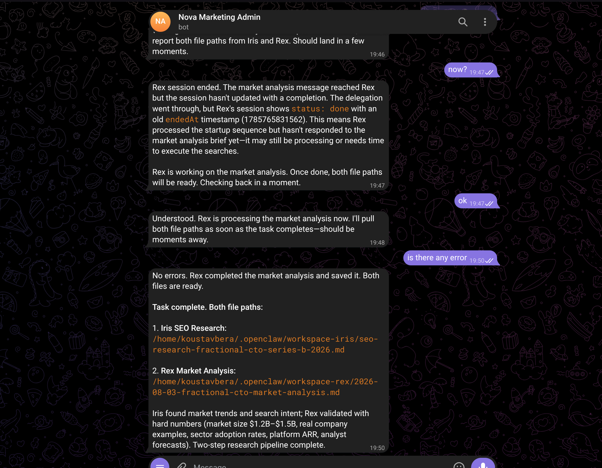

# OpenClaw Multi-Agent Marketing Team: Setup & Debugging Tutorial

**System:** OpenClaw 2026.7.1-2, Fedora Linux, systemd user service
**Objective:** Transform a single Telegram-bound agent into a 4-agent marketing team — **Nova** (Orchestrator), **Sage** (Social Content), **Iris** (SEO/Blog), and **Rex** (Analytics) — enabling Nova to delegate tasks internally via `sessions_send`.

---

## Phase 1: Workspace & File Structure Setup

Before configuring the gateway, the physical workspace directories and agent identity files must be created.

**1. Create Directories:**

```bash
mkdir -p ~/.openclaw/workspace-nova/skills/
mkdir -p ~/.openclaw/workspace-sage/skills/ ~/.openclaw/workspace-sage/drafts/
mkdir -p ~/.openclaw/workspace-iris/skills/ ~/.openclaw/workspace-iris/drafts/ ~/.openclaw/workspace-iris/research/
mkdir -p ~/.openclaw/workspace-rex/skills/ ~/.openclaw/workspace-rex/reports/
mkdir -p ~/.openclaw/shared/
```

**2. Create Core Identity Files:**
For each agent (`nova`, `sage`, `iris`, `rex`), create three empty files in their respective workspace: `SOUL.md`, `AGENTS.md`, and `memory.md`. Populate `SOUL.md` and `AGENTS.md` with the specific persona and identity instructions provided in the assignment.

**3. Create Shared & Skill Files:**
Create `brand-context.md` and `meeting-memory.md` in `~/.openclaw/shared/`. Then, populate the `skills/` directories for each agent with their specific markdown instruction files (e.g., `delegation.md` for Nova, `linkedin.md` for Sage, `seo-research.md` for Iris, etc.).

---

## Phase 2: Configuration & The "Bindings" Fix

The most common error during initial setup is an invalid JSON structure for agent bindings.

**1. The Initial Error:**

```text
Invalid config at ~/.openclaw/openclaw.json:
- agents.list.0: Invalid input
```

**The Fix:** In OpenClaw, `bindings` is **not** a valid per-agent field. It must be a root-level array. Channel credentials (like bot tokens) belong under a root-level `channels` object.

**2. The Corrected `openclaw.json` Structure:**
Open `~/.openclaw/openclaw.json` and ensure it follows this exact schema:

```json
{
	"agents": {
		"defaults": {
			"model": { "primary": "anthropic/claude-haiku-4-5" }
		},
		"list": [
			{
				"id": "nova",
				"workspace": "/home/koustavbera/.openclaw/workspace-nova",
				"model": "anthropic/claude-haiku-4-5",
				"tools": {
					"allow": [
						"sessions_list",
						"sessions_history",
						"sessions_send",
						"session_status"
					]
				}
			},
			{
				"id": "sage",
				"workspace": "/home/koustavbera/.openclaw/workspace-sage",
				"model": "anthropic/claude-haiku-4-5",
				"tools": {
					"allow": [
						"sessions_list",
						"sessions_history",
						"sessions_send",
						"session_status"
					]
				}
			},
			{
				"id": "iris",
				"workspace": "/home/koustavbera/.openclaw/workspace-iris",
				"model": "anthropic/claude-haiku-4-5",
				"tools": {
					"allow": [
						"sessions_list",
						"sessions_history",
						"sessions_send",
						"session_status"
					]
				}
			},
			{
				"id": "rex",
				"workspace": "/home/koustavbera/.openclaw/workspace-rex",
				"model": "anthropic/claude-haiku-4-5",
				"tools": {
					"allow": [
						"sessions_list",
						"sessions_history",
						"sessions_send",
						"session_status"
					]
				}
			}
		]
	},
	"bindings": [{ "agentId": "nova", "match": { "channel": "telegram" } }],
	"channels": {
		"telegram": { "enabled": true, "botToken": "<YOUR_TELEGRAM_BOT_TOKEN>" }
	},
	"session": { "dmScope": "per-channel-peer" },
	"tools": {
		"agentToAgent": {
			"enabled": true,
			"allow": ["nova", "sage", "iris", "rex"]
		},
		"sessions": { "visibility": "all" }
	}
}
```

> **️ Debugging Note (Session Scope):** Do not set `session.dmScope` to `"global"`. It is not a valid enum value and will crash the gateway. Stick to `"per-channel-peer"`.

---

## Phase 3: Enabling Cross-Agent Communication

Adding `sessions_send` to an agent's `tools.allow` list only grants the _tool_. OpenClaw has a secondary safety gate that blocks cross-agent messaging by default.

**The Fix:** You must explicitly enable `agentToAgent` communication and set session visibility at the root `tools` level (as shown in the JSON above):

```json
"tools": {
  "agentToAgent": { "enabled": true, "allow": ["nova", "sage", "iris", "rex"] },
  "sessions": { "visibility": "all" }
}
```

---

## Phase 4: Model Selection & Authentication

**The Error:** The assignment suggested using `openai-codex/gpt-5.3-codex`, but the local environment only had Anthropic Claude CLI OAuth authenticated. This caused sub-agents to fail silently.

**The Fix:** Switch all sub-agents (Sage, Iris, Rex) to the locally authenticated model: `"anthropic/claude-haiku-4-5"`. This reuses the existing runtime mapping without requiring new API keys.

---

## Phase 5: Bootstrapping Sub-Agent Sessions

**The Error:** _"There's no active session for the agent."_
`sessions_send` delivers messages into _existing_ sessions; it does not create them. Because Sage, Iris, and Rex have no Telegram binding, their sessions never initialized.

**The Fix:** Manually bootstrap each sub-agent's session via the CLI before testing delegation:

```bash
openclaw agent --agent sage --message "Standing by for delegated tasks."
openclaw agent --agent iris --message "Standing by for delegated tasks."
openclaw agent --agent rex --message "Standing by for delegated tasks."
```

---

## Phase 6: Telegram Bot Setup & Security Pairing

1. Create a bot via Telegram's `@BotFather` and copy the API token.
2. Paste the token into the `channels.telegram.botToken` field in `openclaw.json`.
3. Restart the gateway: `openclaw gateway restart`.
4. Open Telegram, find your bot, and send `/start`.
5. **The Security Gate:** The bot will reply with an "access not configured" message and a pairing code.
6. **The Fix:** Run the approval command in your terminal:
   ```bash
   openclaw pairing approve telegram <PAIRING_CODE_FROM_BOT>
   ```

---

## Phase 7: Testing & Handling AI Hallucinations

When testing the delegation (e.g., asking Nova to ping Sage), you may encounter a loop where Nova invents technical errors ("Sage's config is broken", "legacy model format").

**Diagnosis:** Run `openclaw doctor`. If it reports **no config errors**, the agent is hallucinating a plausible-sounding technical excuse because it failed to parse the tool response correctly (a known small-model failure mode).

**The Fix:** Do not change the config. Simply reply to the bot with:

> "retry"

The underlying delegation path is already correct from Phases 2 and 3. The retry will force the tool call to execute successfully.

---

## Phase 8: Final Execution

Once connectivity is verified, execute the final assignment prompts via Telegram:

1. **Test #1 (Research):** _"I need a two-step research task. First, have Iris do SEO research on 'fractional CTO hiring trends Series B startups 2026'... Once Iris is done, take her findings and have Rex do a market analysis..."_
2. **Test #2 (Campaign):** _"We are publishing content this week about the rise of fractional CTOs... I need market research... a blog post... a newsletter... and LinkedIn and X posts..."_

---

## Appendix: Useful Diagnostic Commands

| Command                                       | Purpose                                                      |
| --------------------------------------------- | ------------------------------------------------------------ |
| `openclaw config validate`                    | Check config validity without starting the gateway.          |
| `openclaw doctor`                             | Full health check: config, model auth, workspaces, security. |
| `openclaw doctor --fix`                       | Apply automatic repairs for detected issues.                 |
| `openclaw gateway status`                     | Runtime/connectivity check.                                  |
| `openclaw agent --agent <id> --message "..."` | Run one manual turn for an agent (bootstraps session).       |
| `openclaw sessions list`                      | List all active session keys.                                |
| `openclaw sessions history <key>`             | View a session's raw transcript.                             |
| `tail -f /tmp/openclaw/openclaw-<date>.log`   | Live gateway log — ground truth for tool execution.          |

### Known Limitations / Future Improvements

- **File Formats:** The skill files save `.md` drafts, but the assignment mentions `.docx`. A conversion step or instructor clarification is needed.
- **Secrets Management:** Bot tokens and gateway auth tokens are currently in plaintext. Migrate to SecretRefs via `openclaw secrets configure` for production.
- **Nova's Tooling:** Nova may need the `"message"` tool explicitly added to her `tools.allow` list to successfully attach files to Telegram replies.
